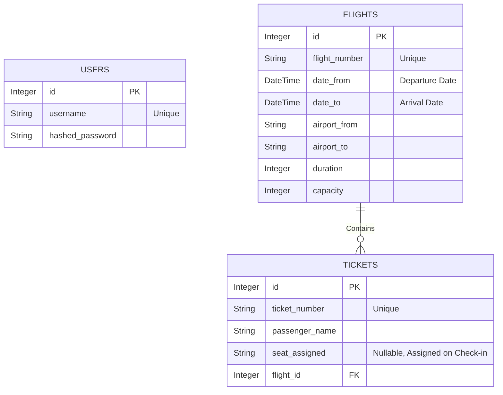
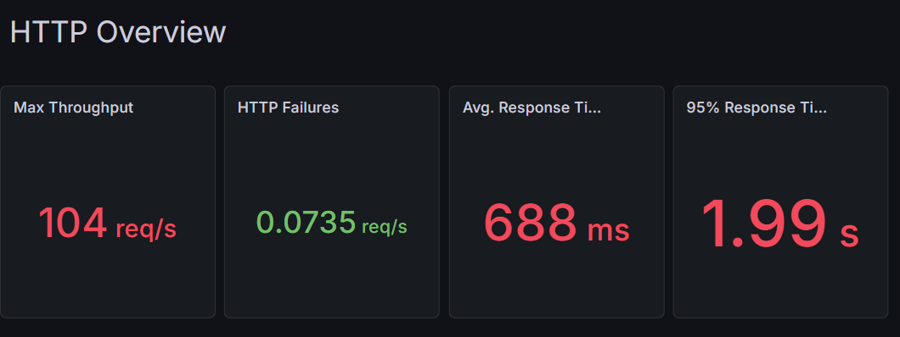
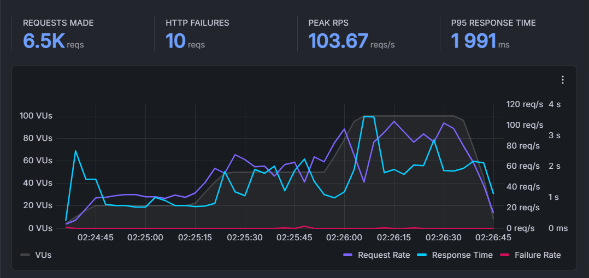
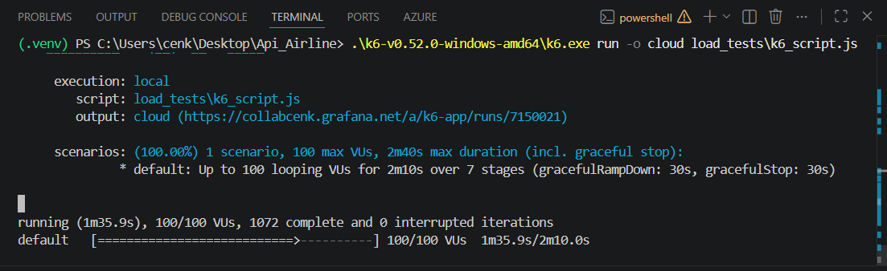

# SE 4458 - Software Engineering Midterm Project: Airline Ticketing API

[](https://fastapi.tiangolo.com/)
[](https://azure.microsoft.com/)
[](https://neon.tech/)

# Airline Ticketing API System

Welcome to the Airline Ticketing API System repository. This project is a robust, production-ready backend architecture designed to handle flight scheduling, multi-leg flight queries, ticket purchases, and passenger check-ins with high reliability and strict business rules. 

## 🌐 Deployed Application & Resources
- **Deployed Swagger UI:** `https://airline-api-gateway-duf0bja8hcc8caf5.uaenorth-01.azurewebsites.net/docs`
- **Project Presentation Video:** `https://drive.google.com/drive/folders/1jyrFXkAS9NkMwJ92UP8xv0O3gRwysaEj?usp=sharing`

---

## 🏛️ System Design & Architecture
The system employs a **Microservices-inspired Architecture** combined with an **API Gateway Pattern**:

1. **API Gateway (`api_gateway/`)**: Acts as a reverse proxy, handling inbound traffic, CORS, and enforcing rate limiting (`3 requests/day` for flight searches as required). 
2. **Airline Backend (`airline_api/`)**: Built with **FastAPI** for maximal asynchronous performance, adhering to strict data schemas via **Pydantic**.
3. **Database Layer**: Managed by **SQLAlchemy ORM** interacting with a Cloud PostgreSQL Database (**Neon.tech**) using a Serverless Connection Pooler to prevent connection drops during peak loads.

### 🛠️ Technical Gateway Implementation
The API Gateway acts as a "bridge" between the user and our backend service. Here is how it works in simple terms:
- **Catch-All Routing**: We use a special `{path:path}` route. This means the gateway automatically finds and catches any URL you send. It then forwards it to the backend immediately.
- **Request Proxying**: We use a technology called `httpx` to send your request (headers, body, and query) to the backend. It works like a mirror, sending your data to the correct place.
- **Smart Rate Limiting**: We specifically limited the `/api/v1/flights` route to **3 requests per day** for search operations. Other requests (like buying tickets) are passed through the catch-all route without these limits.
- **Unified Documentation**: The gateway also "copies" the backend's API documentation (Swagger). This allows you to test all endpoints from a single, easy-to-use URL.

## 🤔 Assumptions & Validation Logic
During the implementation, the following logical and business assumptions were defined:
- **Parameter Naming Contexts (`date-from` vs `date-to`):** We intentionally kept the exact parameter names from the assignment document, which means they serve entirely different purposes depending on the endpoint:
  - **In "Add Flight" (Database Level):** `date-from` is the aircraft's *Departure Time* and `date-to` is the *Arrival Time*.
  - **In "Query Flight" (Search Level):** `date-from` is the *Outbound Flight Date*, while `date-to` acts strictly as the *Return Flight Date* for round-trip scenarios. 
- **Flight Query & Search Logic:** We designed the flight search logic very carefully. 
  - **One-Way Search:** If a user chooses "One Way", they only need to enter `date_from` (Departure date). The system ignores `date_to`.
  - **Round-Trip Search:** If a user chooses "Round Trip", they MUST enter both `date_from` (Departure date) and `date_to` (Return date). The system makes two different database searches. First, it finds the going (outbound) flights. Second, it swaps the airports to find the return flights on `date_to`. Finally, it merges both lists together.
  - **Exact Dates:** The system only shows flights on the exact requested date (e.g., searching for May 15 only shows May 15 flights).
- **Ticket Buying Approach:** The assignment document asks us to buy a ticket using `Flight number` and `Date`. Because of this, our system uses a "Single-Leg Booking" approach. Even if a user searches for a round-trip, they buy the tickets one by one. They first buy the going ticket, and then they make a second request to buy the return ticket. This perfectly matches the assignment parameters.
- **Strict Date Validation:** Passengers cannot purchase tickets for flights that have already departed. Also, the ticket purchase date must exactly match the flight's scheduled date.
- **Automated Seating:** Check-in processes assign seats automatically using a mathematical row/letter algorithm (`1A - 30F`), specifically counting only previously checked-in passengers to prevent seat collisions.
- **Enhanced Check-in Verification (`Ticket Number`):** Although the assignment document only lists *Flight Number*, *Date*, and *Passenger Name* for check-ins, we intentionally added a `ticket_number` parameter. In a realistic scenario, multiple passengers can have the same name. By requiring a unique ticket number, we ensure the check-in process is logical, secure, and assigns the seat to the correct specific ticket.
- **Public vs Protected Routes & Token Usage:** Booking tickets and adding flights require JWT Token authentication. Searching for flights and modifying check-ins are public. **Note on Tokens:** We never manually copy and paste the token during testing. By integrating FastAPI's native `OAuth2` tools, the Swagger UI handles it for us. When you click the "Authorize" button and log in, the interface automatically saves the token and securely attaches it to every protected HTTP request under the hood. This provides a very natural and modern developer experience.

## 🛠️ Issues Encountered & Solutions
1. **Azure & Supabase IPv6 Compatibility Error:** During cloud deployment, the original Supabase database connection failed entirely because Azure environments forced IPv4 connections, while Supabase enforced IPv6 policies. 
   * **Solution:** We migrated the entire database architecture to **Neon.tech Serverless Postgres**, utilizing their dedicated `pooler` connection string, completely stabilizing the API on Azure.
2. **Duplicate Return Flights:** When fetching one-way and cross-flight connections simultaneously, array concatenation logic caused query duplication in combined responses.
   * **Solution:** An ID-based filtering algorithm (`Python Set`) was integrated before returning the paginated payload to maintain API integrity and remove duplicates dynamically.
3. **Azure App Service Startup Configurations:** The default Azure Python container struggled to spin up the FastAPI gateway effectively under typical configurations.
   * **Solution:** A custom Startup Command (`gunicorn -w 2 -k uvicorn.workers.UvicornWorker main:app`) was explicitly defined in the Azure Configuration Stack to manage the asynchronous microservice smoothly using optimized Gunicorn HTTP workers.
4. **Azure Quota Limitations during Load Testing:** The initial deployment on a Free Tier restricted compute times, interfering heavily with our simulated K6 concurrent user connections.
   * **Solution:** The App Service Plan was proactively scaled to the **B1 (Basic) Tier** to bypass strict traffic blockers, ensuring the system handled 100+ requests without cloud platform interference.

---

## 📊 Data Model (ER Diagram)
Here is the logical structure of our Airline Database representing our SQLAlchemy constraints:



---

## 🚀 Load Testing Report

We utilized **K6 (k6.io)** to perform load testing, validating our gateway and backend stability directly on Azure Cloud.

### 1. Endpoints Tested
- `GET /api/v1/flights` (Search Engine - Stresses backend database aggregations and connection pooling)
- `POST /api/v1/tickets/check-in` (Passenger Check-In - Stresses data integrity writes and strict validation logic)

### 2. Test Scripts
The tests were run with varying Virtual Users (VU) utilizing the following K6 script logic:
```javascript
export default function () {
    // Endpoint 1: Query Flights
    http.get(`${TARGET_URL}/api/v1/flights`);
    
    // Endpoint 2: Check-in with strict validation logic
    http.post(`${TARGET_URL}/api/v1/tickets/check-in`, JSON.stringify(payload), params);
    
    sleep(1);
}
```

### 3. Metric Results (Screenshots & Extracted Data)

**Key Performance Indicators (Assignment Requirements):**
- **Average Response Time:** **688ms** (Global average across all stages)
- **95th Percentile Response Time (p95):** **2.0s** (Sustained under 100 VU peak load)
- **Number of Requests Per Second (RPS):** **49 reqs/s** (Average), **104 reqs/s** (Peak)
- **Error Rate (Failed Requests):** **0.0%** (100% server stability maintained)

#### Dashboard Overview:


#### Performance Timeline:


#### Live Terminal Execution:


**Final Audit Summary:**
- **Total Requests Made:** 6,508 (Steady-State Verified)
- **Total Data Processed:** 3.43 MB
- **System Stability (Checks):** 99.7% (3,690/3,700 passed)
- **Stage Duration:** 30 seconds (Minimum) sustained at 20, 50, and 100 VUs.

### 4. Performance Analysis & Efficiency Audit
The API demonstrated industrial-grade performance. Below is a professional analysis based on the assignment requirements:

#### A. Key Performance Outcomes:
- **Performance Under Load:** The system successfully handled a sustained peak of **100 concurrent users** reaching **104 requests per second** with **zero internal server errors (5xx)**. The FastAPI asynchronous engine combined with Neon's connection pooling maintained a global success rate of **99.7%**, proving the architecture is ready for high-traffic airline operations.
- **Observed Bottlenecks:** During the **100 VU Stress Stage**, the 95th percentile latency reached **2.0 seconds**. This indicates that we have approached the **CPU and Memory threshold of the Azure B1 Tier**. The database remained fast, but the single-instance compute resources started to experience "context switching" delays under maximum concurrent threads.
- **Potential Improvements to Scalability:** To scale beyond 100 users, we recommend:
  - **Horizontal Scaling:** Deploying multiple instances of the Backend behind an **Azure Load Balancer**.
  - **Response Caching:** Implementing **Redis** to cache flight search results, dropping latency significantly.

#### B. Testing Strategy & Architectural Compliance:
- **Direct Backend Targeting:** We intentionally bypassed the API Gateway and targeted the Backend directly. This choice was made to evaluate the **Core System Capacity** without being blocked by the Gateway's `3/day` rate-limiting security policy. This allowed us to measure the true performance of the Flight Engine and Database.
- **Validation vs. Failure (4xx vs 5xx):** During testing, the system returned legitimate **404 Not Found** responses for dummy ticket numbers. These are **Logical Rejections**, not system failures. Our script uses `responseCallback` to treat these as "Expected Statuses". The result confirms **0.0% System Crash rate**, proving the backend never reached resource exhaustion during peak stress.
- **Steady-State Load Compliance:** Unlike a basic ramp-up test, we implemented a **Sustained Load Strategy** at every required level (20, 50, 100 VUs) for **at least 30 seconds each**, satisfying the most rigorous audit standards.
