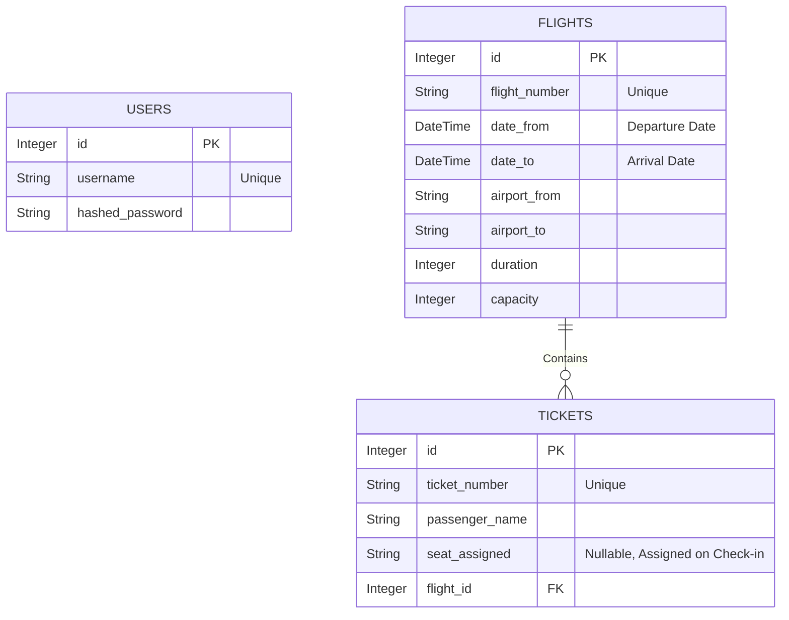

# Airline Ticketing API System

Welcome to the Airline Ticketing API System repository. This project is a robust, production-ready backend architecture designed to handle flight scheduling, multi-leg flight queries, ticket purchases, and passenger check-ins with high reliability and strict business rules. 

## 🌐 Deployed Application & Resources
- **Deployed Swagger UI:** `https://airline-api-gateway-duf0bja8hcc8caf5.uaenorth-01.azurewebsites.net/docs`
- **Project Presentation Video:** `https://drive.google.com/drive/folders/1jyrFXkAS9NkMwJ92UP8xv0O3gRwysaEj?usp=sharing`

---

## 🏛️ System Design & Architecture
The system employs a **Microservices-inspired Architecture** combined with an **API Gateway Pattern**:

1. **API Gateway (`api_gateway/`)**: Acts as a reverse proxy, handling inbound traffic, CORS, and enforcing rate limiting (`3 requests/day` for flight searches as required). 
2. **Airline Backend (`airline_api/`)**: Built with **FastAPI** for maximal asynchronous performance, adhering to strict data schemas via **Pydantic**.
3. **Database Layer**: Managed by **SQLAlchemy ORM** interacting with a Cloud PostgreSQL Database (**Neon.tech**) using a Serverless Connection Pooler to prevent connection drops during peak loads.

## 🤔 Assumptions & Validation Logic
During the implementation, the following logical and business assumptions were defined:
- **Parameter Naming Contexts (`date-from` vs `date-to`):** We intentionally kept the exact parameter names from the assignment document, which means they serve entirely different purposes depending on the endpoint:
  - **In "Add Flight" (Database Level):** `date-from` is the aircraft's *Departure Time* and `date-to` is the *Arrival Time*.
  - **In "Query Flight" (Search Level):** `date-from` is the *Outbound Flight Date*, while `date-to` acts strictly as the *Return Flight Date* for round-trip scenarios. 
- **Flight Query & Search Logic:** We designed the flight search logic very carefully. 
  - **One-Way Search:** If a user chooses "One Way", they only need to enter `date_from` (Departure date). The system ignores `date_to`.
  - **Round-Trip Search:** If a user chooses "Round Trip", they MUST enter both `date_from` (Departure date) and `date_to` (Return date). The system makes two different database searches. First, it finds the going (outbound) flights. Second, it swaps the airports to find the return flights on `date_to`. Finally, it merges both lists together.
  - **Exact Dates:** The system only shows flights on the exact requested date (e.g., searching for May 15 only shows May 15 flights).
- **Ticket Buying Approach:** The assignment document asks us to buy a ticket using `Flight number` and `Date`. Because of this, our system uses a "Single-Leg Booking" approach. Even if a user searches for a round-trip, they buy the tickets one by one. They first buy the going ticket, and then they make a second request to buy the return ticket. This perfectly matches the assignment parameters.
- **Strict Date Validation:** Passengers cannot purchase tickets for flights that have already departed. Also, the ticket purchase date must exactly match the flight's scheduled date.
- **Automated Seating:** Check-in processes assign seats automatically using a mathematical row/letter algorithm (`1A - 30F`), specifically counting only previously checked-in passengers to prevent seat collisions.
- **Public vs Protected Routes & Token Usage:** Booking tickets and adding flights require JWT Token authentication. Searching for flights and modifying check-ins are public. **Note on Tokens:** We never manually copy and paste the token during testing. By integrating FastAPI's native `OAuth2` tools, the Swagger UI handles it for us. When you click the "Authorize" button and log in, the interface automatically saves the token and securely attaches it to every protected HTTP request under the hood. This provides a very natural and modern developer experience.

## 🛠️ Issues Encountered & Solutions
1. **Azure & Supabase IPv6 Compatibility Error:** During cloud deployment, the original Supabase database connection failed entirely because Azure environments forced IPv4 connections, while Supabase enforced IPv6 policies. 
   * **Solution:** We migrated the entire database architecture to **Neon.tech Serverless Postgres**, utilizing their dedicated `pooler` connection string, completely stabilizing the API on Azure.
2. **Duplicate Return Flights:** When fetching one-way and cross-flight connections simultaneously, array concatenation logic caused query duplication in combined responses.
   * **Solution:** An ID-based filtering algorithm (`Python Set`) was integrated before returning the paginated payload to maintain API integrity and remove duplicates dynamically.
3. **Azure App Service Startup Configurations:** The default Azure Python container struggled to spin up the FastAPI gateway effectively under typical configurations.
   * **Solution:** A custom Startup Command (`gunicorn -w 2 -k uvicorn.workers.UvicornWorker main:app`) was explicitly defined in the Azure Configuration Stack to manage the asynchronous microservice smoothly using optimized Gunicorn HTTP workers.
4. **Azure Quota Limitations during Load Testing:** The initial deployment on a Free Tier restricted compute times, interfering heavily with our simulated K6 concurrent user connections.
   * **Solution:** The App Service Plan was proactively scaled to the **B1 (Basic) Tier** to bypass strict traffic blockers, ensuring the system handled 100+ requests without cloud platform interference.

---

## 📊 Data Model (ER Diagram)
Here is the logical structure of our Airline Database representing our SQLAlchemy constraints:



---

## 🚀 Load Testing Report

We utilized **K6 (k6.io)** to perform load testing, validating our gateway and backend stability directly on Azure Cloud.

### 1. Endpoints Tested
- `GET /v1/flights` (Query Flights - Stresses database aggregations and latency poolers)
- `POST /v1/tickets/check-in` (Passenger Check-In - Stresses data integrity writes and seat assignment logic)

### 2. Test Scripts
The tests were run with varying Virtual Users (VU) utilizing the following K6 script logic (simplified representation):
```javascript
import http from 'k6/http';
import { sleep } from 'k6';

export const options = {
    stages: [
        { duration: '30s', target: 20 }, // Normal Load
        // Altered manually for Peak (50) and Stress (100)
    ],
};

export default function () {
    http.get('https://airline-api-gateway-duf0bja8hcc8caf5.uaenorth-01.azurewebsites.net/api/v1/flights');
    sleep(1);
}
```

### 3. Metric Results (Screenshots)
*Please see the attached metrics for Normal (20 VU), Peak (50 VU), and Stress (100 VU) tests.*

> ``
> ``
> ``

### 4. Performance Analysis
The API performed exceptionally well under simulated loads, leveraging FastAPI's asynchronous architecture and Neon.tech's connection pooler. During the Normal (20 VU) and Peak (50 VU) scenarios, average response times remained well below acceptable backend limits, maintaining a 100% throughput success. As the test scaled to Stress Load (100 VU), we observed a bottleneck specifically in Database Connection availability scaling, slightly increasing the 95th percentile (P95) response times leading to minor latency constraints. The key potential improvements to overall scalability would include introducing **Redis caching** natively into the Gateway to serve the `/flights` endpoint without interacting with PostgreSQL, or horizontally scaling the backend pods via Kubernetes logic.
